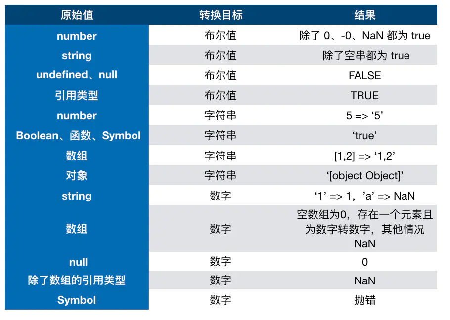

# 该日记会不定时的记录遇到一些新的知识点和不熟悉知识点的大概总结
## 区别querySelector()和getElementsByClassName()
- document.querySelector(selector)是返回选择器匹配的第一个元素，并且selector是选择器字符串
- document.getElementsByClassName(string)返回一个NodeList里面包含所匹配的元素，string为class的属性值
## 字符串的扩展
### unicode
- unicode码规定每个字符对应一个数字，unicode v1.0用2个字节表示所有字符(0~65535)
- unicode码只是规定数字，但在计算机中是以utf-8和utf-16编码方式存储、传输(理解这一点，否则会混淆unicode,utf-8,utf-16)
### utf-8
- utf-8是一种**变长**的编码方式，它可以使用1~4个字节表示一个符号，根据不同的字符变化字节长度  
编码规则：  
1. **单字节字符**，第一位设为0，后面7位为这个字符的unicode码(英语字母的unicode码和ASCII码完全一致)
2. 对于n字节的符号（n>1），第一个字节的前n位都设为1，第n+1位设为0，后面字节的前两位一律设为10。剩下的没有提及的二进制位，全部为这个符号的unicode码。

*unicode码转换成utf-8编码规则,x为可编码的位*
<table>
    <tr><td>unicode符号范围(十六进制)</td><td>unicode符号范围(十进制)</td><td>utf-8编码方式(二进制)</td></tr>
    <tr><th>0000 0000~0000 007F</th><th>0~127</th><th>0xxxxxxx(用1个字节表示)</th></tr>
    <tr><th>0000 0080~0000 07FF</th><th>128~2047</th><th>110xxxxx 10xxxxxx(用2个字节表示)</th></tr>
    <tr><th>0000 0800~0000 FFFF</th><th>2048~65535</th><th>1110xxxx 10xxxxxx 10xxxxxx(用3个字节表示)</th></tr>
    <tr><th>0001 0000~0010 FFFF</th><th>65536~1,114,111</th><th>11110xxx 10xxxxxx 10xxxxxx 10xxxxxx(用4个字节表示)</th></tr>
</table>

示例：  
已知“严”的unicode是4E25（10011100 0100101），根据上表，可以发现4E25处在unicode码的第三行范围内（0000 0800-0000 FFFF），因此“严”的UTF-8编码需要三个字节，即格式是“1110xxxx 10xxxxxx 10xxxxxx”。然后，从“严”的最后一个二进制位开始，依次从后向前填入格式中的x，多出的位补0。这样就得到了，
**“严”的UTF-8编码是“11100100 10111000 10100101”，这是保存在计算机中的实际数据**，转换成十六进制就是E4B8A5，转成十六进制的目的为了便于阅读。
(这里有个问题，“严”的unicode码实际只需用2个字节就可表示，但是用utf-8编码存储要用到3个字节，造成内存浪费，所以这是utf-8编码的一个缺陷)
### utf-16
- utf-16编码以16位无符号整数为单位，**16位无符号表示一个单位，不表示一个字符就只有16位**
- utf-16编码用**2个字节**或**4个字节**表示字符
- 对于unicode码<0x10000，其utf-16编码对应为unicode的16位无符号编码；对于unicode>=0x10000，要用`两个双字节表示`，utf-16的编码规则如下：  
    > 记unicode码为U，U'=U-0x10000,utf-16的编码规则`1101 10yy yyyy yyyy 1101 11xx xxxx xxxx`；将U'的二进制位从低位依次放入utf-16编码
      规则的低位，不够的用0补全，得到的就是utf-16的编码了。例如：`吉`字的unicode码是`20BB7`,`U'=10BB7`转换成二进制码为`0001 0000 1011 1011 0111`
      ,按照规则对应的utf-16编码为`1101 1000 0100 0010 1101 1111 1011 0111`，用两个双字节表示为`\uD842\uDF87`
### ES6中字符的unicode表示法
- ES6可以直接用`\uxxxx`的形式表示一个字符，`xxxx`为unicode的十六进制码点；这种表示仅限于`\u0000~\uFFFF范围`，当unicode码超出这个范围时，就必需用
*两个双字节*表示(这里涉及到使用utf-16编码存储unicode码)，后面引入`\u{xxxx}`方式就能正确解读字符(对于超出2个字节的unicode码，就无需使用*两个双字节表示*)，见下面示例
```javascript
// “吉”的unicode码为20BB7
// 如果直接用\u20BB7表示，ES6会理解为\u20BB+7，由于\u20BB是一个无法打印的字符，就会输出一个空格，即" 7"

\uD842\uDFB7
// 用两个双字节表示，输出"吉"
\u{20BB7}===\uD842\uDFB7
// ture
```
- 加上`\u{}`表示法，js中有6中表示字符串的方法，如下所示
```javascript
'\z'==='z'
'\172'==='z'
'\x7A'==='z'
// 有点不理解'\172'和'\x7A'的原理
'\u007A'==='z'
// 注意不能写成'\u7A'，必须是'\uxxxx'形式
'\u{7A}'==='z'
```
### 字符串的遍历器接口
- ES6为字符串添加Iterator接口，使得可以被`for...of`循环，最大的好处是可以识别unicode码超过`0xffff`的字符
```javascript
let text=String.formCodePoint(0x20BB7);
// for循环无法正确识别超过'0xffff'的字符，在这里会把“吉”当成2个字符
for(let i=0;i<text.length;i++){
    console.log(text[i]);
    // " " 
    // " "
}
// for...of则能正确识别
for (let t of text){
    console.log(t);
    // "吉"
}
```
### 字符串的U+2028和U+2029
JS中允许直接输入字符或字符的转义形式，例如：`"中"==="\u4e2d"`；但是规定有5种字符  
- U+005C：反斜杠（reverse solidus)
- U+000D：回车（carriage return）
- U+2028：行分隔符（line separator）
- U+2029：段分隔符（paragraph separator）
- U+000A：换行符（line feed）  
不能直接输入(直接输出其转义内容)，只能通过转义形式输出；但是`U+2028`和`U+2029`比较特殊，因为JSON格式是可以直接输入这两种字符，所以服务器输出的JSON被JSON.prase()时会导致报错，所有后面ES2019运行JavaScript 字符串直接输入 U+2028（行分隔符）和 U+2029（段分隔符）。  
注意：模板字符串现在就允许直接输入这两个字符。另外，正则表达式依然不允许直接输入这两个字符，这是没有问题的，因为 JSON 本来就不允许直接包含正则表达式。
### 模板字符串
- 模板字符串中如需使用反引号，则要使用反斜杠(\)进行转义，例如：
```javascript
let greeting = `\`Yo\` World!`;
// `Yo` World!
```
- 使用模板字符串输出多行字符串，会保留所有的`空格`，`缩进`输出
- 模板字符串中嵌入变量要写在`${}`中，大括号中可以是任意JavaScript表达式，如果大括号中的值不是*字符串*，会按照一般规则转换成字符串(比如对象调用toString方法)
### 标签模板
概念：  
模板字符串可以紧跟在一个*函数名*后面，该函数将被调用处理该模板字符串，这称为*标签模板*的功能  
- 标签模板其实不是模板，是函数调用的一种特殊形式。“标签”指的是函数，紧跟在它后面的模板字符串是它的参数
- 如果标签模板中有变量，会将模板字符串处理成多个参数，再调用函数，如下示例
```javascript
let a=5;
let b=10;
tag`Hello ${a+b} word ${a*b}`;
// 等同于,注意模板字符串中未被变量替换的那部分参数包含空格,空串
tag(['Hello ',' word ',''],15,50);
```
- 标签模板的一个重要应用就是过滤用户输入的字符串，如下示例
```javascript
let sender='<script>alert("abc")</script>'//恶意代码
function safeHtml(templateData){
    let s=templateData[0];
    for (let i=1;i<arguments.length;i++){
        let arg=String(arguments[1]);
        s+=arg.replace(/&/g,"&amp;")
              .replace(/</g,"&lt;")
              .replace(/>/g,"&gt;");
        s+=templateData[i];
    }
    return s;
}
let message=safeHtml`<p>${sender} has sent you a message.</p>`
// message= <p>&lt;script&gt;alert("abc")&lt;/script&gt; has sent you a message.</p>
```
### String.prototype.codePointAt()
- JS中是以UTF-16储存字符，一个字符占2个字节，对于需要使用4个字节保存的字符，JS会认为有2个字符
- `codePointAt()`的参数是字符的索引位置，返回对应unicode码的十进制，如果想转为十六进制可以使用`toString(16)`
- `codePointAt()`可以正确识别`unicode>0xFFFF`字符，例如：
```javascript
// '吉'的UTF-16编码为`\uD842\uDFB7`
let s='吉a'
s.codePointAt(0) //0x20BB7
s.codePointAt(1) //0xDFB7
s.codePointAt(2) //61(a的十进制)
// 使用codePointAt()虽能正确识别unicode大于0xFFFF的字符，但是在使用的时候还是会把它看成2个字符，可以使用for...of和Spread解决

for (let ch of s){
    console.log(ch.codePointAt(0).toString(16));
    // 134071
    // 61
}
let arr=[...s]
arr.forEach(ch=>{
    console.log(ch.codePointAt(0).toString(16));
})
```
### 字符串的其他方法扩展
- JS中使用`indexOf(searchValue[,fromIndex])`判断一个字符是否在某个字符串中，ES6新增了`includes()`,`startsWith()`,`endsWith()`三个判断方法
- `repeat()`返回一个新的字符串，将原来的字符串重复n次，注意`repeat()`方法的参数
    1. 参数如果是负数或者`Infinity`会报错，但是`-1~0`的负数会当做`0`处理
    2. 参数如果是小数，会取整，所有`-1~0`的负数会当做`0`处理
    3. 参数如果是`NaN`，会当做`0`处理
    4. 参数如果是字符串，会转为数字，转不了数字的转为`NaN`
- `padStart(targetLength[,padString])`和`padEnd()`用于补全字符串，前者用于头部补全，后者用于尾部补全
    1. 如果`targetLength`小于原字符串的长度，补全失效，返回原来的字符串
    2. 如果`padString`加上原字符串的长度大于`targetLength`，会截取`padString`超出的部分
    3. 如果省略第二个参数，则使用`空格`补全
- `trimStart()`和`trimEnd()`作用同`trim()`方法一样，用于消除`空格`，`Tab键`，`换行符`等等不可见的空白符
    1. `trimSart()`,`trimEnd()`,`trim()`不改变原字符串，返回新字符串
    2. `trimLeft()`是`trimStart()`的别名；`trimRight()`是`trimEnd()`的别名
### 拓展知识
字符在计算机中的编码方式
## Module的语法&&Module加载的实现
### export语法
- export规定的是对外接口而不是值，所以要加"{}"，并且对外接口与内部变量是一 一对应关系
- export规定的对外接口与内部变量是动态绑定，意味着可以获取内部变量的实时值，这一点和CommonJS规范完全不同
- export可以出现在模块顶层任何位置，不能出现在块级作用域内(因为ES6模块是静态编译)
- export可以导出变量、对象、函数、class等
```javascript
// 写法一
export var m=1
// 写法二，推荐的写法
export {firstName,lastName,age}
// 报错，输出的不是接口，而是值
var f=1
export f
```
改名接口：  
```javascript
// 在其他模块导入该模块时的接口是myName和myAge，其实并不推荐在export命令中改名接口
export {firstName as myName,age as myAge}
```
### import语法
- import导入的接口是只读，不允许在脚本中改写接口
- import命令的from指定模块文件的位置，可以是相对路径或者绝对路径。如果只有模块名，则需要配置文件告诉JS引擎模块文件的位置
- import命令具有提升效果，会提升到模块的头部，首先执行，这种行为本质是import在编译阶段执行的，所以不能在import命令中使用表达式和变量这种在执行时才能得到结果的语法结构
- import命令会执行所加载的模块，如果一个模块被加载多次，实际只执行一次(被导入的模块始终先于导入模块执行)。可以有(import  "./profile.mjs")的写法，表示仅仅执行profile.mjs模块，但不输入任何值
- import整体加载是将所加载模块的接口全部加载到一个对象上，该对象能进行静态分析，不允许运行时改变
```javascript
// 同export命令一样，一定要加"{}"，导入的变量必须与模块规定的对外接口一致
import {firstName,lastName,age} from "./profile.mjs"
```
改名接口：  
```javascript
// 推荐通过import改名接口，其优势在于可以更改第三方模块的接口
import {firstName as myName,age as myAge} from "./profile.mjs"
```
模块的整体加载：  
```javascript
// 将profile.mjs模块的接口全部加载到circle这个对象上
import * as circle from "./profile.mjs"
// 报错，circle对象能静态分析，不允许再添加其它属性
circle.foo="hello"
```
### export default语法
- 一个模块只能有一个默认接口
- export default后面不能声明变量，因为default本质上就是一个变量
- import命令导入默认接口时不需要"{}"，可以使用任意名称指定默认接口
```javascript
// default.mjs模块的默认接口
export default a
// 这种写法也可以，因为本质上是把值赋给变量default
export default 13

// new.mjs模块加载default.mjs模块的默认接口
// 等同于 import {default as newA} from "./default.mjs"
import newA from "./default.mjs"
```
### import和export的复合写法
- import和export的复合写法实际上是转发接口，当前的模块并不能直接使用被导入的接口
- 复合写法的export *命令会忽略默认接口
```javascript
export {foo,bar} from "my_module.mjs"
// 可以简单理解为以下写法
// 需要注意的是foo,bar并没有直接导入当前模块
import {foo,bar} from "my_module.mjs"
export {foo,bar} 
```
复合写法的接口改名，整体输出，默认接口输出，具名接口改名默认接口输出，默认接口改为具名接口输出：  
```javascript
// 接口改名
export {foo as myFoo} from "my_module.mjs"
// 整体输出，忽略my_module.mjs默认接口
export * from "my_module.mjs"
// 默认接口写法
export {default} from "my_module.mjs"
// 将具名接口改为默认接口
export {definite as default} from "my_module.mjs"
// 等同于
import {definite} from "my_module.mjs"
export default definite

// 将默认接口改为具名接口
export {default as definite} from "my_module.mjs"
```
以下三种写法没有对应的复合写法：  
```javascript
import * as someIdentifier from "someModule.mjs"
import someIdentifier from "someModule.mjs"
import someIdentifier,{nameIdentifier} from "someModule.mjs"
```
### import()
- import()类似CommonJS中的require()，都是运行时加载模块，区别在于前者是**异步加载**，后者是同步加载
- import()的参数指定所加载模块的位置，import()返回一个promise对象
- import()加载模块成功之后，这个模块会当做一个对象(包含所有的对外接口,包括默认接口)作为then()的参数
- import()可以运行在非模块脚本中，而import命令只能运行在模块脚本中
```javascript
// canvas.js模块的对外接口
export { create, createReportList};
export default 24;
// main.js加载canvas.js模块
// import()会立即返回一个promise<pending>，加载模块是异步执行的
var canvas=import('./modules/canvas.js');
// 因为import()是异步加载模块，所以输出的是一个pending状态的promise
console.log(canvas);
// 再次强调，setTimeout是在"下一轮事件循环执行"
setTimeout(function(){
        console.log(canvas);
},0);
// then()是在本轮事件循环完后执行，所以比setTimeout先执行
var promise=canvas.then(module=>{console.log(module)});
```
注意点：  
```javascript
// then()的参数是一个模块对象，所以可以使用对象的解构赋值的语法输出接口
import('./modules/canvas.js').then(({create, createReportList}) => {/*执行的代码*/});
// 如果canvas.js模块有默认接口，可以使用default参数直接获得
import('./modules/canvas.js').then(module => {console.log(module.default)});
// 上一条语句也可以使用具名方式
import('./modules/canvas.js').then({default:theDefault}=> {console.log(theDefault)});
// 如果要同时加载多个模块，可以使用Promise.all()
Promise.all([
  import('./module1.js'),
  import('./module2.js'),
  import('./module3.js'),
])
.then(([module1, module2, module3]) => {
   ···
});
```
### Module的加载实现
#### 浏览器加载规则
- 使用`<script type="module"></script>`加载模块，加载模块时默认是异步加载，等同于打开了`<script>`标签的defer属性
- `<script>`标签的defer属性要等整个页面正常渲染结束(DOM树完全生成以及其他脚本执行完)才会执行
- `<script>`标签的async属性只要下载完成就会中断渲染继续执行脚本，执行完后再继续渲染
- `<script>`标签的defer和async属性只对外部文件有效，一次对于嵌入的脚本会忽略defer属性
- 如果有多个`<script>`标签，defer属性能保证按顺序加载脚本，async属性就不能保证
- 同普通脚本一样，也可以使用内嵌的模块，语法行为同加载外部脚本完全一致  
浏览器加载模块的注意事项：  
1. 如果你尝试用本地文件加载HTML 文件 (i.e. with a file:// URL), 由于JavaScript 模块的安全性要求，你会遇到CORS 错误。你需要通过服务器来做你的测试
2. Moudle的扩展名为.mjs方便与传统.js文件的区别，为了服务器能正确识别.mjs的扩展名，需要以MIME-type为javascript/esm加载或者其他javaScript兼容的MIME-type的类型(该问题还未解决)
#### 模块的注意事项
- 代码是在模块作用域运行，而不是在全局作用域。模块内部的顶层变量外部不可见
- 模块中代码自动采用严格模式，不管你有没有声明'use strict'
- 模块之中，顶层this返回undefined，所以在模块中顶层使用this没有意义
- 模块被加载多次，只执行一次
#### Node加载ES6模块
- 使用Node加载ES6模块比较麻烦，因为Node的CommonJS模块和ES6模块并不兼容，目前解决方案是将两者分开，采用各自的加载方案
- Node要求ES6模块采用.mjs后缀名，require命令不能加载.mjs文件，相反.mjs文件中也不能使用require命令
- 为了与浏览器的import加载相同，Node的.mjs文件支持URL路径
- 目前Node的import命令只支持加载本地模块(file://协议)  
[Node加载ES6模块](http://es6.ruanyifeng.com/#docs/module-loader)

------
## JS中的数据类型
### 基本数据类型
#### undefined
- undefined类型只有一个值--`undefined`
- 对于**未初始化**和**未声明**的变量，使用typeof操作符都会得到`undefined`这个结果，如下例
```javascript
var message;
// var age;
typeof message;//undefined
typeof age;//undefined
```
> 对于未初始化的变量使用typeof得到`undefined`结果很容易理解，但对于未声明的变量得到`undefined`容易让人困惑；这样做有其逻辑上的
> 合理性，*如果我们都能做到初始化变量，那么在使用typeof得到`undefined`就能知道该变量还未声明，而不是未初始化*
#### null
- null类型是第二个只有一个值的数据类型--`null`
- 从逻辑角度上看，null表示一个空对象指针，因此使用typeof的结果为`object`
- 实际上，undefined值是null的派生值，因此ECMA-262规定对它们的相等性测试要返回true(注意，仅仅针对于宽松相等运算符`==`)
- undefined和null的用途完全不同。我们不必对一个变量显式地初始化为undefined，但是对于要保存对象还未真正保存对象的变量使用null初始化，
  这样不仅可以体现null作为空对象指针的惯例，也有助于区分null和undefined
#### boolean
- JS中的所有数据类型都有与Boolean类型值等价的值，要将一个值转换为其对应的Boolean类型值，可以调用`Boolean()`函数
#### number
- 整数可以用十进制、八进制(字面值前导为0，后面如果超出数值范围，将当做十进制解析，在严格模式下八进制的字面量是无效的，会抛出错误)、十六进制(字面值
前导为0x)；在进行算术运算时，所有的八进制和十六进制表示的数值最终都将被转化成十进制
- 由于保存浮点数值需要的内存是整数的两倍，因此JS会不时地将浮点数值转为整数数值(针对小数点后面没有任何数字和浮点数本来就表示整数，如1.0)；对于极大或
极小的值可以使用e表示法表示的浮点数值表示ECMASctipt 会将那些小数点后面带有 6 个零以上的浮点数值转换为以 e 表示表示的数值（例如，0.0000003 会被转换成 3e-7）。
- 由于浮点数值计算会产生舍入误差，永远不要测试一个特定的浮点数值
- ECMAScript的最小值保存在Number.MIN_VALUE，最大值保存在Number.MAX_VALUE，如果数值超出范围，则会被转为`-infinity`和`infinity`(infinity值
不能参与计算)；要判断一个数值是否是有穷的，使用`isFinite()`(全局函数)
- NaN，是一个特殊的数值，这个数值用于表示一个本来要返回数值的操作数未返回数值的情况（这样就不会抛出错误了）。这个数值有两个特点，其一是任何涉及
NaN的操作都会返回NaN，其二是NaN跟任何值都不相等，包括它自身
- ECMAScript 定义了`isNaN()`函数(全局函数)。这个函数接受一个参数，该参数可以是任何类型
- `Number()`,`parseInt()`,`parseFloat()`这三个函数可以将非数值转为数值，`Number()`的参数可以是任何数据类型，`parseInt()`,`parseFloat()`专门
用于把字符串转换成数值
- `Number()`转换的规则如下：
    - 如果是 Boolean 值，true 和 false 将分别被转换为 1 和 0
    - 如果是数字值，只是简单的传入和返回
    - 如果是 null 值，返回 0
    - 如果是 undefined，返回 NaN
    - 如果是字符串，遵循下列规则：
        - 如果字符串中只包含数字（包括前面带正号或负号的情况），则将其转换为十进制数值，即"1"会变成 1，"123"会变成 123，而"011"会变成 11（注意：前   导的零被忽略了）；
        - 如果字符串中包含有效的浮点格式，如"1.1"，则将其转换为对应的浮点数值（同样，也会忽略前导零）；
        - 如果字符串中包含有效的十六进制格式，例如"0xf"，则将其转换为相同大小的十进制整数值；
        - 如果字符串是空的（不包含任何字符），则将其转换为 0；
        - 如果字符串中包含除上述格式之外的字符，则将其转换为 NaN。
    - 如果是对象，则调用对象的 valueOf()方法，然后依照前面的规则转换返回的值。如果转换的结果是如果转换的结果是 NaN，则调用对象的 toString()方法，    然后再次依照前面的规则转换返回的字符串值。
- `parseInt()`解析字符串规则如下：
    - 忽略字符串前面空格，直到找到第一个非空格字符，并且如果不是数字字符或负号，则返回`NaN`(parseInt("")返回NaN,Number("")返回0)
    - 如果第一个非空格字符是数字字符，则会依次解析第二个字符，直到解析结束或者遇到一个非数字字字符(在parseInt中小数点会被视为非数字字符)
    - parseInt()能够识别整数格式(即十进制，八进制，十六进制)，但在识别八进制时，ECMAScript3和ECMAScript5有分歧(ECMAScript5不具备识别八进制能力)
    - parseInt()能接受第二个参数(指定转换的基数)，默认为10
- `parseFloat()`解析字符串规则同`parseInt()`类似，区别在于`parseFloat()`将第一个小数点视为有效数字字符，没有第二个参数，只解析十进制，因此转换十     六进制时返回0
#### string
- JS中除了`null`和`undefined`的所有数据类型的值几乎都有toString()方法，该方法将值转为string类型
- `toString()`方法可以接受一个参数，表示*输出数值的基数*，没有参数默认输出数值的基数为10
- `String()`可以将任何类型的值转为字符串，其转换规则如下：
    - 如果值有toString()方法，调用toString()方法(没有参数)并返回相应结果
    - 如果值是null，则返回"null"
    - 如果值是undefined，则返回"undefined"
### 复合数据类型(Object)
- 从技术角度讲，ECMA-262 中对象的行为不一定适用于JavaScript中的其他对象。浏览器环境中的对象，比如 BOM 和 DOM 中的对象，都属于宿主对象，因为它们是
由宿主实现提供和定义的。ECMA-262 不负责定义宿主对象，因此宿主对象可能会也可能不会继承 Object。
----

## JS中的运算符
- 使用运算符主要考虑*运算符的优先级和关联性，运算符的操作个数和返回值*，[参考MDN运算符优先级](https://developer.mozilla.org/zh-CN/docs/Web/JavaScript/Reference/Operators/Operator_Precedence)
### typeof和instanceof
1. typeof可以判断原始类型和对象，有几点需要注意：
    - typeof null 输出结果为Object,实际上null不是对象，这是JS的一个历史BUG
    - typeof function 输出结果为function，函数在JS中也是属于对象类型的
2. instanceof运算符表示构造函数的prototype属性是否在实例对象的原型链上
    - instanceof用于判断对象的实例。在ES规范中只能通过构造函数的prototype属性获取原型对象，但是实例对象可以通过非标准属性
 __ proto__(例如：obj.__ proto__)获取原型对象。虽然instanceof直接用于原始类型的判断不可行，但可以通过下面方法判断
 ```javascript
            class PrimitiveString{
                static [Symbol.hasInstance](x){
                    return typeof x === 'string'
                }
            }
            console.log('hello world' instanceof PrimitiveString);//输出结果为true
```
#### 拓展知识：
需了解symbol原始类型值和内置symbol值以及Symbol对象
### 一元加减运算符(优先级为16，关联性从右到左)
- 一元加减运算符**不同于**加减运算符，其操作数只有一位
- 一元加运算符("+操作数")的操作数是数值不做任何改变；如果是非数值，则使用`Number()`函数相同的转换规则对操作数进行转换，然后返回数值
- 一元减运算符("-操作数")和一元加运算符遵循同样的规则，最后将得到的数值转换为负数
### 递增减运算符
- 前置递增减运算符和后置递增减运算符优先级和关联性不同；前置优先级为16，关联性从右到左，后置优先级为17，无关联性
- 前置递增减运算符是先递增减操作数，再返回数值；后置递增减运算符是先返回数值，再递增减操作数。例如：
```javascript
var num1=2;
var num2=20;
var num3=--num1+num2;//num3=21,num1=1
var num3=num1--+num2;//num3=22,num1=1
```
- 递增减运算符可以用于任何的数据类型，在用于非数值时遵循`Number()`函数转换规则，并且会将不是`number`类型的变量转换为`number`类型，例如：
```javascript
var num1=true;
var num2="123";
var num3=--num1//num1=0,typeof num1==>"number"
var num4=num2--;//num2=122,typeof num2==>"number"
```
#### 乘性运算符(`*`,`/`,`%`)
- 乘法，除法，取模优先级14，关联性从左到右
- 乘性运算符遇到非Number类型，会遵循`Number()`函数转换规则
- 乘法特殊值规则：
    - Infinity*0=NaN
    - Infinity*非0数值=Infinity(-infinity)
    - Infinity*Infinity=Infinity
    - Infinity*NaN=NaN
- 除法特殊值规则：
    - 非0数值/0=Infinity(-Infinity);非0数值/Infinity=0
    - Infinity/NaN=NaN
    - Infinity/Infinity=NaN
    - 0/0=NaN
- 取模特殊值规则：
    - Infinity%有限值=NaN
    - 有限值%Infinity=被除数
    - 有限值%0=NaN
    - Infinity%Infinity=NaN
    - 0%任何数值=0
### 加性运算符
- 加减法优先级13，关联性从左到右；
- “+”加法运算符
    1. 如果操作数有一方为字符串，则另一方会转为字符串
    2. 如果操作数没有字符串，会优先转为数字，转不了数字再转为字符串  
### `&&`和`||`和`!`
- `!`优先级16，关联性从右到左；`&&`优先级6，关联性从左到右；`||`优先级5，关联性从左到右
- `&&`和`||`如果操作数不是布尔值，不一定是返回布尔值，如下表所示(expr可能是任何一种类型，不一定是布尔值)   
<table>
<tr><td>语法</td><td>说明</td></tr>
<tr><th>expr1 && expr2</th><th>如果expr1为真值，则返回expr2，否则返回expr1</th></tr>
<tr><th>expr1 || expr2</th><th>如果expr1为真值，则返回expr1，否则返回expr2</th></tr>
</table>

- `&&`和`||`是从左到右计算，如果左边的值已经能确定结果，那么右边的值不会再执行(假设是函数不会被调用)，因此具有短路效果；我们可以利用`||`
的短路作用，避免为变量赋null或undefined值，例如：
```javascript
var myObject=preferedObjec || backupObject
// 变量 preferredObject 中包含优先赋给变量 myObject 的值，变量 backupObject 负责在 preferredObject 中不包含有效值的情况下提供后备值。
```
- 双重非(!!)运算符，显式的将任意值转换为对应的*布尔值*
### 关系运算符
关系运算符在对非数值进行比较时，遵循下列规则：
- 字符串的比较是对字符编码值进行比较
- 如果有一个操作数是数值，则另一个操作数将转换为数值进行比较
- 如果一个操作数是对象，则调用对象的valueOf()方法，然后将得到的数值结果按上面规则进行比较；如果没有valueOf()方法，则调用toString()方法
，然后将得到的字符串结果按上面规则比较
- 如果一个操作数是布尔值，则先转换为数值再进行比较
### 扩展运算符(...)和rest参数
扩展运算符：  
- 扩展运算符(...)好比rest参数的逆运算，大多用在函数调用中(rest参数是用在**函数形参中**)
    > Spread只有在函数调用时用在圆括号中，其他时候用在圆括号中会报错
- 任何定义了Iterator接口的对象，都可以用Spread转为真正的数组；反之则不能扩展，可以用Array.form()将类似数组对象和具有Iterator接口的对象转为真正的数组
- Spread可以对**字面量对象**进行展开。其行为是将字面量对象的**可枚举属性**拷贝到新的对象中
    > 如果Spread用在数组和函数调用中，只能使用具有Iterator接口的对象  
- 在构造字面量对象中使用Spread和Object.assign()行为一致(两者都是浅拷贝)
    > Object.assign()会触发setter函数，而Spread则不会  
- 使用new关键字来调用构造函数时，不能直接使用`数组+apply`的方式，例如：`new myConstructor.apply(this,args)`  
*示例一：不能替换或者模拟Object.assign()函数*
```javascript
var obj1 = { foo: 'bar', x: 42 };
var obj2 = { foo: 'baz', y: 13 };
const merge = ( ...objects ) => ( { ...objects } );
var mergedObj = merge ( obj1, obj2);
// mergedObj={ 0: { foo: 'bar', x: 42 }, 1: { foo: 'baz', y: 13 } }
var mergedObj = merge ( {}, obj1, obj2);
// mergedObj={ 0: {}, 1: { foo: 'bar', x: 42 }, 2: { foo: 'baz', y: 13 } }
// 在这段代码中, 展开操作符并没有按预期的方式执行: 而是先将多个解构变为剩余参数(rest parameter), 然后再将剩余参数展开为字面量对象.
```
*示例二：没有Spread之前，把数组元素传给构造函数的方法*
```javascript
function applyAndNew(constructor, args) {
   function partial () {
      return constructor.apply(this, args);
   };
   if (typeof constructor.prototype === "object") {
      partial.prototype = Object.create(constructor.prototype);
   }
   return partial;
}
function myConstructor () {
   console.log("arguments.length: " + arguments.length);
   console.log(arguments);
   this.prop1="val1";
   this.prop2="val2";
};
var myArguments = ["hi", "how", "are", "you", "mr", null];
var myConstructorWithArguments = applyAndNew(myConstructor, myArguments);
console.log(new myConstructorWithArguments);
```
rest参数：  
- rest参数(...变量名)是将函数的多余参数放入这个变量中，这个变量是**数组**
- rest参数只能作为函数的最后一个参数，否则在调用函数时会报错；并且函数的length属性不包括rest参数
    > fn的length属性指的是形参数量，不包括rest参数；arguments的length属性指的是实参数量
----
## JS中的类型转换
- JS中的类型转换只有三种情况：
1. 转为boolean
2. 转为string
3. 转为number
> 注意图中有一个错误，Boolean 转字符串这行结果我指的是 true 转字符串的例子，不是说 Boolean、函数、Symblo 转字符串都是 `true`

### == vs ===
面试经典题：[] == ![]  
"=="在比较时涉及到类型转换，"==="不会涉及类型转换；在使用"=="时要注意操作数的类型：  
1. 如果都是原始类型(string/number/boolean，除去特殊值null/undefined/NaN)，两者都转为数值进行判断；
2. 特殊值的话，null/undefied/NaN 和任何值(不包括自身) == 都为 false；null 和 undefined == 为 true，分别与自身 == 也为true；NaN 与自身 == 为 false；
3. 原始类型和引用类型进行比较，原始类型是数值引用类型转为数值，原始类型是字符串引用类型转为字符串，原始类型是布尔值两者都转为数值；
4. 引用类型和引用类型进行比较，比较的是内存地址。  
回到[] == ![]上面这个问题。"!"运算符优先级大于"=="，实际比较的是 []==false，根据上面的规则3，两个操作数都将转换为数值即0==0，所以输出true
### 不足知识点
- 对象转为原始数据类型调用内置函数[[ToPrimitive]]的逻辑
- 比较运算符的转换逻辑
[参考《前端面试之道》](https://juejin.im/book/5bdc715fe51d454e755f75ef/section/5bdc715f6fb9a049c15ea4e0)

----
## this指定
- 在全局执行环境中，不管是否是严格模式，this都指定为全局对象
- 在函数执行环境中，严格模式默认指定undefined，非严格模式指定为全局对象
- 箭头函数，this 关键字指向的是它当前周围作用域(简单来说是包含箭头函数的常规函数，如果没有常规函数的话就是全局对象)  

> 在箭头函数中如果将this传递给call、bind、或者apply，它将被忽略。不过你仍然可以为调用添加参数，不过第一个参数（thisArg）应该设置为null。bind函数只会生效一次；箭头函数没有prototype属性
------
## 异步
1. 单线程模型：  
众所周知，JavaScript只在一个线程上运行，但是JavaScript引擎有多个线程，单个脚本只能在一个线程上运行(称为主线程)，其他线程都是在后台配合。而且JavaScript语言本身并不慢，慢的是I/O操作，比如等待Ajax请求返回结果，因此引入了事件循环机制(Event Loop)  
Event Loop：CPU完全可以不管I/O操作，挂起处于等待中的任务，先运行排在后面的任务。等到I/O操作返回结果，再回头把挂起的任务继续执行下去。

2. 任务队列和事件循环：  
任务队列：  
它是用于存放被引擎挂起的异步任务(异步任务没有回调函数将不会进入队列)  
PS：*实际上引擎会根据异步任务的类型将它存放在多个队列中*  
事件循环：  
事件循环是一种机制

3. 异步操作的几种方式：  
    - 回调函数，优点是比较容易理解，实现；缺点是不利于代码的阅读和维护，各个部分之间高度耦合(coupling)，使得程序结构混乱、流程难以追踪(尤其多个回调函数嵌套使用)，而且每个任务只能指定一个回调函数
    - 事件监听，优点是容易理解，可以绑定多个事件，每个事件可以指定多个回调函数，而且可以去耦合(decoupling)，有利于模块化。缺点是整个程序都是事件驱动，运行流程不清晰，很难看出主流程。
    - 发布/订阅，这种方法的性质同"事件监听"类似，但是明显优于后者。因为可以通过查看"信号中心"，了解存在多少个信号(每个信号就是一个事件)、每个信号有多少个订阅者(每个订阅者就是一个回调)，从而监控程序的运行。[发布/订阅的定义和例子](https://wangdoc.com/javascript/async/general.html#%E5%8F%91%E5%B8%83%E8%AE%A2%E9%98%85)
    
4. 多个异步操作的流程控制  
    - 串行执行，我们可以编写一个流程控制函数，让它控制异步任务，一个任务完成以后，再执行另一个
    - 并行执行，流程控制函数也可以并行执行，即所有异步任务同时执行
    - 并行与串行的结合，设置一个门槛，每次最多只能并行执行n个异步任务，这样就避免过分占用系统资源   
示例代码：同步任务launcher保证任务队列中只有2个异步任务，异步操作callback负责将items数组的成员以2的倍数添加到results数组中    
```javascript
var items=[1,2,3,4,5,6];
var results=[];
var running=0;
var limit=2;
// 一个异步操作
function async(agr,callback){
    console.log("参数为"+agr+",在1s后返回结果");
    setTimeout(function(){
        callback(agr*2);
    },1000);
}
function final(){
    console.log("完成："+results);
}
function launcher(){
    while(running<limit && items.length>0){
        let item=items.shift();
        async(item,function(result){
            results.push(result);
            running--;
            if(items.length>0){
                launcher();
            }else if(running==0){
                final();
            }
        });
        running++;
    }
}
launcher();
```
**一定要仔细研究这个示例代码，熟悉异步的工作方式**

## 异步中定时器的应用
### setTimeout && setInterval
setTimeout:  
1. 用法：setTimeout(fn|code,delay[,arg1,arg2,...])，arg1,arg2,等参数会作为回调函数fn的参数传入  
2. setTimeout函数返回一个整数，作为定时器编号，可以用clearTimeout函数取消  
ps:***setTimeout和setInterval返回值是连续的，互相依赖的***
3. setTimeout和setInterval是在**事件下轮循环才执行**
4. setTimeout中的回调操作如果是调用一个对象方法，该方法中的**this会指向全局对象**(这时对象的方法是在全局环境中执行了)  
例如：
```javascript
var x=1;
var obj={
    x:2,
    y:function(){
        console.log(this.x);
    }
//这时输出的x=1,而不是x=2  
setTimeout(obj.y,1000);
//解决方案一：用一个函数将obj.y封装
setTimeout(function(){
    obj.y();
    // 如果是以下写法，依然输出x=1
    let b=obj.y;
    b();
},1000);
//解决方案二(推荐用法)：用bind方法绑定obj
setTimeout(obj.y.bind(obj),1000);
```

setInterval:  
1. 与setTimeout的前三点一样  
2. setInterval指定的delay是包含了每次执行任务本身所消耗的时间，因此实际上，两次执行任务的间隔时间小于delay。例如，setInterval指定每 100ms 执行一次，每次执行需要 5ms，那么第一次执行结束后95毫秒，第二次执行就会开始。如果某次执行耗时特别长，比如需要105毫秒，那么它结束后，下一次执行就会立即开始。

示例代码：利用定时器返回的整数取消当前任务所有的setTimeout
```javascript
var gd=setInterval(clearAllSetTimeouts,0);
function clearAllSetTimeouts(){
    var id=setTimeout(function(){},0);
    while(id>0){
        if(id!==gd){
            clearTimeout(id);
        }
        id--;
    }
}
```
### setTimeout(f,0)的几个应用场景
应用场景一：调整事件执行顺序  
因为事件具有冒泡机制，有时子元素的回调函数会先于父元素的回调函数执行，例如：
```html
<input type="button" id="my_button" value="click">
```
```javascript
var input=document.getElementById("my_button");
input.onclick=function A(){
//这种写法会导致点击按钮时，先执行<input>的回调函数，即input.value="clickinputbody"而不是期望的input.value="clickbodyinput"
    input.value+="input";
//使用setTimeout(f,0) 
    setTimeout(function B(){
        input.value+="input";
    },0);
}
document.body.onclick=function(){
    input.value+="body";
}
```
应用场景二：  
背景：用户自定义的回调函数，通常在浏览器默认动作之前完成  
例如：用户在文本框输入文本，keypress事件的回调函数会在浏览器接收文本之前就执行，导致用户只能将之前的字母转为大写(不包含用户当前输入的值)
```html
<input type="text" id="input_box">
```
```javascript
document.getElementById("input_box").onkeypress=function(event){
    //错误的做法
    this.value=this.value.toUpperCase();
    //正确的做法
    //将this的值绑定到变量self上，否则setTimeout的回调函数中的this指向全局对象
    var self=this;
    setTimeout(function(){
        self.value=self.value.toUpperCase();
    },0);
}
```
应用场景三：  
setTimeout(f,0)的实际意义是在浏览器最早可执行的空闲阶段执行，所以一些计算量大、耗时长的任务可以分成几个部分放在setTimeout中执行  
示例代码：为div元素添加背景色，要求背景色从#100000到#FFFFFF连续变化
```html
<div id="change_background" style="width:100px;height:100px;border:1px solid red"></div>
```
```javascript
var div=document.getElementById("change_background");
//写法一：javascript代码执行速度快于DOM操作，会造成大量的DOM操作堆积
for(let i=0x1000000;i<=0xFFFFFF;i++){
    div.style.background="#"+i.toString(16);
}
//写法二：使用setTimeout(f,0)分解任务
var timer=null;
var i=0x100000;
function func(){
    timer=setTimeout(func,0);
    if(i++===0xFFFFFF){
        clearTimeout(timer);
    }
    div.style.background="#"+i.toString(16);
}                                     
timer=setTimeout(func,0);
```
[setTimeout的示例代码](./setTimeout-example/myscript.js)

---
## promise对象
概念：  
promise对象是异步编程的一种解决方案，比传统的解决方案(回调和事件)更强大、更合理。比如说createAudioFileAsync(audioSettings,successCallback,failureCallback)，负责创建一个音频文件，并且在成功创建后调用successCallback，失败后调用failureCallback；最新的方法是createAudioFileAsync(audioSettings)返回一个promise对象，并且把回调函数附加到promise对象上执行。

优点：  
- 将异步操作以同步操作的方式表达出来，避免了回调函数的层层嵌套

promise对象特点：  
- promise对象状态不受外界影响，只有**异步操作的结果**可以决定promise对象的状态。一个promise对象代表一个异步操作，有三种状态pending,fulfilled,rejected。
- promise对象状态一旦改变就无法更改，promise对象状态改变只能从pending到fulfilled，或pending到rejected；并且在异步操作完成后再添加回调函数也会执行

使用promise时的约定：  
- 在本轮"事件循环"完成之前，回调函数是不会被调用
- 通过then()添加的回调函数总是会被调用，即使是在异步操作完成之后添加
- 通过多次调用then()，可以添加多个回调函数，它们会按照插入顺序一个接一个独立执行
## Promise构造函数
Promise构造函数用于生成promise对象实例
```javascript
const promise=new Promise((resolve,reject)=>{
    //some code
    if(异步操作成功){
        return resolve(message);
    }else{
        return reject(error);
    }
})
```
说明：  
- new Promise()中的executor函数会立即执行(即(resolve,reject)=>{})
- resolve()和reject()由js引擎提供，负责改变promise对象状态，并且把**参数**作为结果传递给promise的回调函数
- 如果resolve()或者reject()的参数是一个promise实例，即一个异步操作(p2)返回另一个异步操作(p1)，则p2的状态由p1决定，见示例
```javascript
const p1 = new Promise(function (resolve, reject) {
  setTimeout(() => reject(new Error('fail')), 3000)
})
const p2 = new Promise(function (resolve, reject) {
  setTimeout(() => resolve(p1), 1000)
})
// 在1s后p2变为resolve状态，但由于返回p1，又等2s后p1为rejected，因此p2状态也为rejected；实质p2后面的then(),catch()是处理p1返回的结果
p2.then(result => console.log(result)).catch(error=>console.log(error));
```
- 在resolve()和reject()执行完后，代码还是会继续执行。一般来说，resolve()和reject()执行完后创就完成了建promise对象的使命，后面的语句应该放在then()中执行
为了避免意外，在resolve()和reject()前面加上return即可解决
## Promise.prototype.then()
- then()会返回一个**全新的promise实例**
- then()的回调函数返回的结果会作为下一个then()回调函数的参数
- then()的回调函数可能也会返回一个**promise实例**(替代了then()返回的promise实例)，那么下一个then()的回调函数会等待该promise实例的状态变化才执行
```javascript
Promise.resolve("hello").then(function(post) {
  //返回一个promise对象，替代了then()返回的promise对象
  return Promise.resolve(post);
  //由then()返回一个promise对象，将该返回值作为参数传递给下一个回调函数，注意这里不会执行该语句，因为上面语句已经有return
  return "world";
}).then(function (comments) {
  console.log("resolved: "+comments);
}, function (err){
  console.log("rejected: "+err);
});// "resolved: hello"
```
## Promise.prototype.catch()
- catch()是then(null,failureCallback)的简写，也会返回一个**全新promise实例**
- promise内部抛出的错误未被捕获不会影响外面的代码执行(promise会吃掉错误),建议在promise后面加一个catch()用于捕获错误

示例：区别setTimeout异步操作和其他异步操作的执行顺序
```javascript
const promise = new Promise(function (resolve, reject) {
  // 在脚本主线程任务执行完后再执行，即在“下一轮事件循环执行”
  setTimeout(function () { throw new Error('test') }, 0);
  resolve('ok');
  // 在Promise函数执行完后执行，即在“本轮事件循环执行”
  Promise.reject("error").catch((error)=>console.log(error));
  console.log("比error先输出");
});
promise.then(function (value) { console.log(value) });
```
> 比error先输出  
> error  
> ok  
> Error('test')
## Promise.prototype.finally()
- 不管promise对象最终状态如何都会执行finally
- finally()的最终也会返回promise实例，状态由调用`Promise.resolve(callback)`决定
- finally()会返回原来的值，如下：
```javascript
var p1=Promise.resolve(2).finally(()=>{});
// 控制台输出的p1
//[[PromiseStatus]]:"resolved"
//[[PromiseValue]]:2
var p2=Promise.reject(3).finally(()=>{});
// 控制台输出的p2
//[[PromiseStatus]]:"rejected"
//[[PromiseValue]]:3
```
Promise.prototype.finally的实现：
```javascript
Promise.prototype.finally=function(callback){
    let p=this.constructor;
    return this.then(function(value){
        return p.resolve(callback()).then(()=>value);
    },function(error){
        return p.resolve(callback()).then(()=>{throw error});
    })
}
```
## Promise.all()
```javascript
const p1 = new Promise((resolve, reject) => {
  resolve('hello');
})
.then(result => result);

const p2 = new Promise((resolve, reject) => {
  // throw new Error('报错了');
  resolve('world');
})
.then(result => result);

Promise.all([p1, p2])
.then(result => console.log(result))
.catch(e => console.log(e));
```
- 接收的参数是一个具有iterator接口的对象(比如数组),用于将多个promise实例包装成一个promise对象
- 示例中**只有**当P1,p2都为fulfilled，Promise.all()包装的promise的状态才为fulfilled，并将p1,p2实例的结果作为数组传递给then()的回调函数
- 示例中**只要**当P1,p2中有一个变为rejected，Promise.all()包装的promise的状态就为rejected，并将rejected实例的结果作为参数传递给catch()的回调函数
## Promise.race()
- 同Promise.all()类似，都是将多个promise实例包装成一个promise对象
- 不同的是**只要**p1,p2中有一个状态变化，就将**率先**状态变化的那个实例的结果作为参数传统给then()或catch()的回调参数
- 从字面理解Promise.all()和Promise.race()的不同,"all意味着全部实例状态，race意味竞赛，谁先变化谁就被传出"
## Promise.resolve()
Promise.resolve()根据参数用于快捷生成一个promise对象；参数分为四种情况：
### 参数为promise实例
Promise.resolve()会原封不动的返回这个promise实例
### 参数为thenable对象
Promise.resolve()会生成一个promise对象(但不会改变它的状态)，然后调用thenable对象的then方法(这时才改变promise对象的状态)
```javascript
var thenable={
    then:function(resolve,reject){
        resolve('hello');
    }
};
// 生成一个promise对象，然后调用thenable的then方法，状态为resolve，然后返回给常量P
const p=Promise.resolve(thenable);
p.then(value=>{console.log(value)}).catch(reason=>{console.log(reason)});
```
### 参数不是thenable对象，或者根本不是对象
Promise.resolve()会生成一个promise对象，并且状态为resolve。Promise.resolve()的参数会同时传统给回调函数
### 不带参数
Promise.resolve()直接返回一个resolve状态的promise对象
## Promise.reject()
- Promise.reject()比Promise.resolve()方法干脆多了，直接返回一个rejected状态的promise对象
- Promise.reject()的参数会原封不动的作为后续方法的参数，见示例
```javascript
var thenable={
    then:function(resolve,reject){
        resolve('hello');
    }
};
// 直接生成rejected状态的promise,不会调用thenable.then()，这一点与Promise.resolve()不同
const p=Promise.reject(thenable);
p.catch(reason=>{console.log(reason)});
// reason===thenable ==>true
```
## AJAX(Asynchronous JavaScript And XML)
概念：  
> AJAX是异步的JavaScript和XML（Asynchronous JavaScript And XML）。简单点说，就是使用 XMLHttpRequest 对象与服务器通信。 它可以使用JSON，XML，HTML和text文本等格式发送和接收数据

特性：  
- 在不重新加载页面的情况下发送请求给服务器
- 可以接受并使用从服务器返回来的数据

Step 1-怎样发送http请求：  
```javascript
// 创建一个请求对象
var httpRequest=new XMLHttpRequest();
// 监听onreadystatechange事件
httpRequest.onreadystatechange=handler;
// 设置请求的方法，url,是否异步(可选，默认为true，异步)
httpRequest.open('GET',url);
// 发送请求,send()的参数可以是任何你想发送给服务器的内容，如果是 POST 请求的话。发送表单数据时应该用服务器可以解析的格式
httpRequest.send()
```
[发送POST请求的示例](https://developer.mozilla.org/zh-CN/docs/Web/Guide/AJAX/Getting_Started)

Step 2-处理服务器响应：  
```javascript
// 检查请求状态(readyStatus)和服务器响应码
function handler(){
    // 表示服务器接收到请求并且成功处理请求，已经做好响应准备
    if(httpRequest.readyStatus===XMLHttpRequest.DOME){
        // 响应码200表示服务器返回数据成功
        if(httpRequest.status===200){
            // 接收并处理服务器返回的数据
            // 服务器以文本的形式返回
            httpRequest.responseText;
            // 服务器以XMLDocument对象返回，之后可以使用JavaScript处理
            httpRequest.responseXML;
        }
    }
}
```
readyStatus状态值如下：  
- 0 (未初始化) or (请求还未初始化)
- 1 (正在加载) or (已建立服务器链接)
- 2 (加载成功) or (请求已接受)
- 3 (交互) or (正在处理请求)
- 4 (完成) or (请求已完成并且响应已准备好)  
注意：**如果open()方法第三个参数设置为false，表示以同步的方式发送请求，就不需要监听onreadystatechange,但不推荐这样做**  
[参考示例](https://developer.mozilla.org/zh-CN/docs/Web/Guide/AJAX/Getting_Started)  
[了解XMLHttpRequest API](https://developer.mozilla.org/zh-CN/docs/Web/API/XMLHttpRequest/Using_XMLHttpRequest)

---
## 闭包
概念：  
闭包是由函数以及创建该函数的词法环境组合而成。**这个环境包含了这个闭包创建时所能访问的所有局部变量**

特点：  
1. 闭包可以让你从内部函数访问外部函数作用域
2. 在JS中，函数在每次创建时生成闭包
3. 闭包是JS语言特有的，因为可以在函数内部声明函数，这是传统编程语言不具有的特性
4. 每个闭包都是引用自己的词法作用域

闭包面试经典题：
```javascript
for(var i=1;i<=5;i++){
    setTimeout(function timer(){
        console.log(i);
    },i*1000);
    // 最终输出五次6
}
```
原因：由于var变量具有提升作用，所以`i`是一个全局变量，timer()执行时是从全局环境中获取`i`的值  
解决方法一：
```javascript
for(var i=1;i<=5;i++){
    (function(j){
        setTimeout(function timer(){
            console.log(j);
        },j*1000);
    })(i);
}
```
在立即执行函数中创建了timer这个闭包，timer闭包引用的词法环境是局部变量`j`，而在每次循环时`j=i`

解决方法二：
```javascript
for(var i=1;i<=5;i++){
    setTimeout(function timer(j){
        console.log(j);
    },j*1000,i);
}
```
每次循环的`i`会当做timer()的参数传入(timer还是个闭包，只是没有获取外部环境的变量，获取的是它函数内部自己的变量)

解决方法三：
```javascript
for(let i=1;i<=5;i++){
    setTimeout(function timer(){
        console.log(i);
    },i*1000);
}
```
使用ES6引入的let关键词，它是块级作用域，每次创建timer闭包时引用的都是独立的词法环境  
[在循环中创建闭包常见错误](https://developer.mozilla.org/zh-CN/docs/Web/JavaScript/Closures)

性能考量：  
> 如果不是某些特定任务需要使用闭包，在其它函数中创建函数是不明智的，因为闭包在处理速度和内存消耗方面对脚本性能具有负面影响。
## 变量提升(var,let,const)
提升：  
是一种将变量和函数的声明移到函数作用域(如果不在任何函数内的话就是全局作用域)最顶部的机制。  
注意：**从概念的字面意义上说，“变量提升”意味着变量和函数的声明会在物理层面移动到代码的最前面，但这么说并不准确。实际上变量和函数声明在代码里的位置是不会动的，而是在编译阶段被放入内存中**

暂时性死区：  
在声明变量之前使用变量，JS会抛出异常；let和const存在暂时性死区，var不存在暂时性死区  
注意：**let和const也存在提升，只是因为暂时性死区的原因导致不能在声明它之前使用**

- 函数提升优先于变量提升，**函数提升会把整个函数挪到作用域顶部，变量提升只会把声明挪到作用域顶部**
- var 存在提升，我们能在声明之前使用。let、const 因为暂时性死区的原因，不能在声明前使用
- var 在全局作用域下声明变量会导致变量挂载在 window 上，其他两者不会
- let 和 const 作用基本一致，但是后者声明的变量不能再次赋值并且在声明时就要初始化
- JS中鼓励先声明再使用，符合逻辑和代码维护  
```javascript
var a = 1
let b = 1
const c = 1
// 在全局作用域中声明let,const变量不会挂载到window对象上，这一点和var不同
console.log(window.b) // undefined
console.log(window.c) // undefined
function test(){
// 这里的变量a在编译阶段虽然存在提升但是因为“暂时性死区”原因不能在声明之前使用
// 这里的变量a是块级作用域，和全局作用域的变量a互不影响，因此可以使用相同的变量名
  console.log(a)
  let a
}
test()
```
JS中存在提升的原因：为了解决函数间互相调用的情况，见示例：  
```javascript
// 如果不存在提升，那么test2()将永远无法执行
function test1() {
    test2()
}
function test2() {
    test1()
}
test1()
```

---
## 浅拷贝&&深拷贝
- 在JS中对于原始数据类型拷贝的是原始值，而对象拷贝的是引用值，所以拷贝对象容易使两个对象互相影响
- 对象分浅拷贝和深拷贝，对象的浅拷贝只复制一层，对象的深拷贝复制多层
- 浅拷贝和深拷贝只针对Object和Array这种复杂的对象
- Object.assign()和扩展运算符(...)适合浅拷贝对象
- JSON.parse(JSON.stringify())适合深拷贝对象，但也有其局限
    - 会忽略 undefined
    - 会忽略 symbol
    - 不能序列化函数
    - 不能解决循环引用的对象

### 浅拷贝应用
解法方法一：  
使用Object.assign(target,...source)
```javascript
var obj1={x:1};
// Object.assign()拷贝的是source对象中可枚举属性的属性值
// 需要注意如果source对象属性的属性值是对象，那么拷贝到target对象是该对象的引用
var obj2=Object.assign({},obj1);
obj1.x=2;
// obj2.x=1
obj2.x;
```

解决方法二：
```javascript
var obj1={x:1};
// 使用扩展运算符
var obj2={...obj1};
obj1.x=2;
// obj2.x=1
obj2.x;
```
### 深拷贝应用
```javascript
let obj = {
  a: 1,
  b: {
    c: 2,
    d: 3,
  },
}
obj.b.c={a:1};
obj.b.c.a={x:1};
let newObj = JSON.parse(JSON.stringify(obj));
obj.b.c.a.x=2;
// 输出1
newObj.b.c.a.x;
```
[参考深拷贝](https://juejin.im/book/5bdc715fe51d454e755f75ef/section/5bed40d951882545f73004f6)

---
## 原型&&原型链
- Object.prototype和Function.prototype是JS引擎创建的两个特殊对象
- 所有实例对象都是由构造器生成，它的__proto__属性隐式指向原型对象，并通过__proto__形成原型链
- 函数比较特殊，即有__proto__属性，也有prototype属性；__proto__指向Function.prototype；prototype属性指向该函数所生成的实例对象的原型对象
- Function.prototype.__ proto__ ===Object.prototype，Object.prototype是所有对象的终点  

## class的基本语法
- class本质上是函数，内部定义的方法前面不需要加"function"关键词，方法之间不需要","分隔，内部定义的方法不可枚举，与原型继承不同
- constructor方法是class默认的方法，通过new创建实例对象时自动调用，默认返回实例对象；如果没有显式定义，JS引擎会自动创建一个空的constructor；
- 实例的属性和方法必须显式定义在实例对象上(即定义在this对象上)，否则都定义在原型上
- 实例属性新的写法是定义在class的顶层，并且前面不用加this，只存在属性名和属性值(千万别以为属性是定义在原型上的)
- class的内部可以定义属性的getter和setter，并且存/取值函数是定义在属性的属性描述对象上
```javascript
class A{
    constructor(name){
        this.name=name;
    }
    // 这里的x是A.prototype的属性，区别于x='hello'(实例对象上的属性)
    get x(){
        return "hello";
    }
    set x(value){
        console.log('setter:'+value)
    }
}
var descriptor=Object.getOwnPropertyDescriptor(A.prototype,x);
get in descriptor  //true
set in descriptor  //true
```
- class的属性名可以采用表达式
```javascript
var methodName="getValue";
class A{
    [methodName](){/*...*/}
}
```
- class也可以采用表达式，可以写出立即执行的class
```javascript
// class采用表达式，Me表示类名，只能在class内部使用(Me.name)，在外部无法使用；如果内部用不到可以省略
var person = new class Me{
  constructor(name) {
    this.name = name;
  }
  sayName() {
    console.log(this.name);
  }
}('张三');
person.sayName(); // "张三"
```
- 静态方法和静态属性只能通过类名直接调用；静态方法中的this指向类，而不是实例对象；静态方法和静态属性可以通过子类继承，也可以通过super对象调用
- ES6不支持私有属性和私有方法，只能通过变通方法达到目的(参考阮一峰的《ES6标准入门》class基本语法章节)
- ES6为new命令添加了new.target属性，详情参考《ES6标准入门》
### 注意事项
- 类和模块内部自动采用严格模式
- class不存在提升(即不能在定义class之前使用class)
- this的指向，见示例
```javascript
class Logger {
  printName(name = 'there') {
    this.print(`Hello ${name}`);
  }

  print(text) {
    console.log(text);
  }
}
const logger = new Logger();
// 对象解构赋值，对象的原型的属性和方法也能通过对象解构赋值
const { printName } = logger;
// 这时单独使用printName()，this指向该方法运行时的环境(即class的内部，不是全局环境)
printName(); // TypeError: Cannot read property 'print' of undefined
```
[更多class的基本语法](http://es6.ruanyifeng.com/#docs/class)
## 原型继承和class继承
常考面试题：原型如何实现继承？class如何实现继承？class本质是什么？
### 原型继承
组合继承：(最常用的继承方式)  
- 核心方式是在子类的构造函数中通过**Parent.call(this)继承父类的属性**，然后改变子类的原型为**new Parent()来继承父类的函数**
- 优点在于构造函数可以传参，不会与父类引用属性共享，可以复用父类的函数
- 缺点就是在继承父类函数的时候调用了父类构造函数，导致**子类的原型**上多了不需要的父类属性，存在内存上的浪费。并且子类实例无法找到正确的构造函数
```javascript
function Parent(value){
    this.val=value;
}
Parent.prototype.getValue=function(){
    console.log(this.val);
}
function Child(value){
    // 在new Child()时就已经继承了父类的属性
    Parent.call(this,value)
}
// 调用了父类构造函数，使得Child.prototype上也有父类的属性，造成内存的浪费
Child.prototype=new Parent();
// child.constructor=function Parent(),不能找到child的正确构造函数
const child=new Child(1);
```

寄生组合继承：(优化组合继承的缺点)
```javascript
function Parent(value){
    this.val=value;
}
Parent.prototype.getValue=function(){
    console.log(this.val);
}
function Child(value){
    Parent.call(this,value);
}
// Child.prototype={constructor:Child},使得原型上没有父类Parent的属性了,并且还能找到正确的构造函数
Child.prototype=Object.create(Parent.prototype,{
    constructor:{
        value:Child,
        enumerable: false,
        writable: true,
        configurable: true
    }
});
// child.constructor=function Child()
const child=new Child(1);
```
### Class继承
- 原型继承，实质是**先创造子类的实例对象，然后赋值给this，然后再将父类的属性和方法添加到this上面（Parent.call(this)）**
- class的继承，实质是**先将父类实例对象的属性和方法，加到this上面（所以必须先调用super方法），然后再用子类的构造函数修改this**
- class的继承机制(ES6继承)的一大优势可以继承原生构造函数，参见下文“原生构造函数的继承”

#### super关键词：
作为函数使用：  
- super指的是父类的构造函数，但是返回的是子类的实例对象(即this指向子类的实例对象)
- 在子类的constructor方法中必须先调用super()，否则会报错
- super作为函数使用，只能用在constructor方法中，用在其他地方会报错

作为对象使用：  
1. super作为对象时，在普通方法中指向父类的原型对象；在静态方法中指向父类
2. 在子类的静态方法中通过super调用父类的方法时，方法内部的this指向**当前的子类**。见示例一
3. ES6 规定，在子类普通方法中通过super调用父类的方法时，方法内部的this指向**当前的子类实例**。
4. 如果用super对某个属性赋值，由于this指向当前子类实例，赋值的属性会变成子类实例的属性，见示例二
5. 使用super时必须显式指定是作为函数使用还是对象使用，否则引擎会报错
6. 由于对象总是继承其他对象，可以在任意一个对象中使用super关键字，见示例三  
上面的2，3，4点是super比较惊奇的地方[super的实现](https://segmentfault.com/a/1190000015565616)
示例一：
```javascript
class A {
  constructor() {
    this.x = 1;
  }
  static print() {
    console.log(this.x);
  }
}
class B extends A {
  constructor() {
    super();
    this.x = 2;
  }
  static m() {
    super.print();
  }
}
// 为子类B赋予静态属性x
B.x = 3;
B.m() // 3
```
示例二：
```javascript
class A {
  constructor() {
    this.x = 1;
  }
}
class B extends A {
  constructor() {
    super();
    this.x = 2;
    super.x = 3;
    // 表明super.x并没有为A.prototype.x赋值
    console.log(super.x); // undefined
    console.log(this.x); // 3
  }
}
let b = new B();
```
示例三：
```javascript
var obj={
    toString(){
        return "myObject:"+super.toString();
    }
};
obj.toString()//myObject:[object object]
```
#### class的prototype和__proto__
*虽然class的本质是函数，但与函数的prototype和`__proto__`有些许差别*  
类的继承是按照下面模式：  
```javascript
Object.setPrototypeOf=function(obj,proto){
    obj.__proto__=proto;
    return obj;
}
```
- B.`__proto__`===A
- B.prototype.`__proto__`===A.prototype
- A作为一个基类不存在任何继承就当做一个普通函数，即A.`__proto__`===Function.prototype, A.prototype.`__proto__`===Object.prototype
```javascript
class A {}
class B extends A {}
// Object.setPrototypeOf(B,A)
B.__proto__ === A // true
// Object.setPrototypeOf(B.prototype,A.prototype)
B.prototype.__proto__ === A.prototype // true
```
#### 原生构造函数的继承
- ES5中**不允许**继承原生构造函数，因为原生构造函数的this不能绑定，导致子类无法获取原生构造函数的内部属性
- ES6中**允许**即继承原生构造函数，因为ES6的继承机制是先新建父类的实例对象this，然后再用子类修改子类构造函数；这与ES5中先新建子类的实例对象this，再把父类的属性添加到子类上的继承机制完全不同。
- extends关键字后面可以有多种类型值(例如：带有prototype属性的函数)
- 继承原生构造函数意味着可以自定义数据结构，见示例一；但是注意继承Object的子类有一个行为差异，见示例二。  
示例一：自定义一个带有版本控制功能的数组
```javascript
class VersionedArray extends Array{
    constructor(){
        super();
        this.history=[[]];
    }
    // 每提交一次(即每执行一次commit())，将当前数组添加到history数组中
    commit(){
        this.history.push(this.slice());
    }
    // 每次回退(即每执行一次revert())，将当期数组恢复到最后一次提交的数组
    revert(){
        this.splice(0,this.length,...this.history[this.history.length-1]);
    }
}
```
示例二：
```javascript
class NewObj extends Object{
    constructor(){
        // arguments对象的length属性反应实参的个数，函数的length属性反应形参的个数
        super(...arguments);
    }
}
var o=new NewObj({attr:'hello'});
// o.attr=undefined 表明实例对象o里并不存在attr属性
o.attr==='hello'//false
```
- ES6 改变了Object构造函数的行为，一旦发现Object方法不是通过new Object()这种形式调用，ES6 规定Object构造函数会忽略参数。

---
## Array.prototype的方法
### Array.prototype方法的返回值的几种情况
1. 返回新数组:
    > 对于有些方法不会修改原始数组，返回值都是新生成的数组对象，例如slice(),map()等等
2. 返回修改的值：
    > 对于有些方法修改原始数组，返回值一般都是修改的值，例如splice(),shift(),pop(),push()
3. 不返回任何值(即返回undefined)，例如forEach()
4. 其他，例如indexof()返回1或-1
### Array.prototype.map()
语法：
```javascript
Array.prototype.map(callback(currentVal[,index,array]){
    // 一定要有返回值,否则将以undefined返回到新数组中
}[,thisArg])
```
注意事项：  
1. map方法处理数组元素的范围是在callback方法第一次调用之前就已经确定了。调用map方法之后追加的数组元素不会被callback访问。如果存在的数组元素改变了，那么传给callback的值是map访问该元素时的值。在map函数调用后但在访问该元素前，该元素被删除的话，则无法被访问到。
2. 如果 thisArg 参数提供给map，则会被用作回调函数的this值
3. callback函数只会在有值的索引上被调用；那些从来没被赋过值或者使用 delete 删除的索引则不会被调用。
4. 因为map生成一个新数组，当你不打算使用返回的新数组却使用map是违背设计初衷的，请用forEach(返回值为undefined)或者for-of替代
5. 通常callback只需接受一个参数，但并不意味着map方法只给callback传递一个参数，见示例一
示例一：  
```javascript
// parseInt(string,radix)接收两个参数，导致遍历时如下
// parseInt("1",0)==>1; parseInt("2",1)==>NaN; parseInt("2",2)==>NaN;
["1","2","3"].map(parseInt);// [1,NaN,NaN]
```
拓展知识：
```javascript
// radix为数值n表示将string解析为对应的进制数，然后返回十进制数
// radix没有指定或者指定为0，按十进制解析string；string如果是以0x或0X开头，则指定为16进制
// parseInt一旦遇到一个在指定进制中不合法的字符后，立即停止解析并且忽略后面所有的字符。
let num=parseInt("7*6",10);// 7
```
### Array.prototype.filter()
语法：
```javascript
Array.prototype.filter(callback(currentVal[,index[,array]]){
    // 在遍历数组的时候将返回值为true的元素放入新数组，
}[,thisArg])
```
注意事项：同map方法
### Array.prototype.reduce()
语法：
```javascript
Array.prototype.reduce(callback(accumulator,currentVal[,index[,array]]){}[,initialVal])
```

---
## 对象的扩展
### 属性访问
- **点记法**后面跟的是一个**有效的JavaScript标识符**；**方括号法**后面跟的是一个**字符串**，这也意味着非字符串对象会通过`toString()`方法转为相应的字符串
- **对象的属性名**必须是**字符串**或者`Symbol`，任何非字符串对象都无法作为对象的键名，会通过`toString()`转为相应的字符串
- ES6中引入了*计算属性名*，允许在`[]`中放入表达式，计算结果作为属性名，如下示例：
```javascript
var param="size";
var foo={
    [param]:12,
    ["mobile"+param.charAt(0)+param.slice(1)]:4
}
// foo={size:12,mobileSize:4}
```
### 对象字面量表示法和JSON的区别
- JSON只允许`"property":value`的语法形式的属性定义。属性名必须使用双引号括起来，并且属性定义不允许使用简便语法
- JSON中属性值只允许是字符串，数组，数字，null，true,false或其他JSON对象
- JSON中不允许将值设置为函数
- `Date`等对象，经过`JSON.parse()`处理后，会变成字符串
- `JSON.parse()`不会处理计算的属性名，会当错误抛出